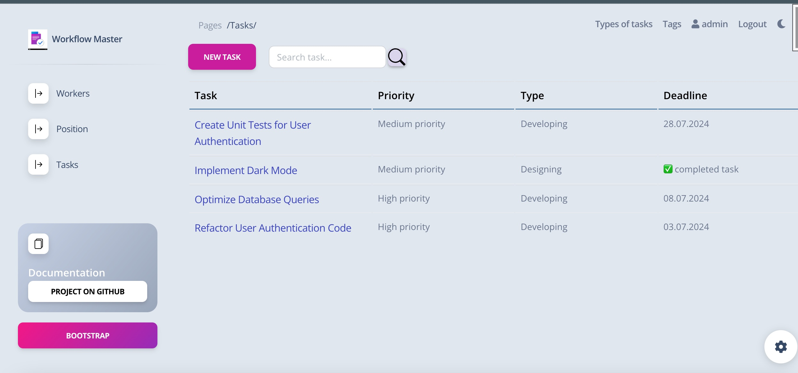

# Workflow Master

The Workflow Master is a powerful tool designed to streamline and simplify the process of managing tasks and handling problems during product development within a team. It provides a centralized platform where team members can create, assign, and track tasks, ensuring efficient collaboration and effective project management.

With the Workflow Master, team members can easily create new tasks, providing essential details such as task name, description, deadline, priority, and assignees. 

The Update Task form allows team members to assign tasks to appropriate individuals, ensuring that the right person is responsible for the task's completion. This feature promotes transparency, collaboration, and effective task distribution within the team.

As tasks progress, team members can update the task status, indicating whether it's in progress, completed, or overdue. By marking tasks as done, team members can easily track progress and ensure timely completion of tasks, enhancing overall productivity and meeting project deadlines.
## Check it out

[Workflow Master deployed to Render](https://task-manager-av4g.onrender.com/)

## Installing

Python3 must be already installed.

```shell
git clone https://github.com/kleotan901/workflow_master.git
cd workflow_master
python3 -m venv venv
source venv/bin/activate
pip install -r requirements.txt
python3 manage.py migrate
python3 manage.py runserver #stsrts Django Server
```

 
`python manage.py loaddata task_manager_db_data.json`

- After loading data from fixture you can use following superuser:
  - Login: `admin`
  - Password: `Qay12345`

## Configuration

The project uses environment variables for configuration. Please follow these steps to set up the required configuration files.


### `.env` and `.env_sample` File

The .env file is used to store sensitive information and configuration variables that are necessary for the project to function properly.

The .env_sample file serves as a template or example for the .env file. It includes the necessary variables and their expected format, but with placeholder values.
 
 To configure the project:

- Locate the .env_sample file in the project's root directory.
- Duplicate the .env_sample file and rename the duplicated file to .env.
- Open the .env file and replace the placeholder values with the actual configuration values specific to your setup.

Remember to keep the .env file secure and avoid sharing it publicly or committing it to version control systems.

## Features

* Authorization functionality for Worker/User
* Managing tasks with essential details such as name, description, deadline, priority, and assignees
* Track the number of tasks in progress for each worker
* Monitor status of tasks (in progress, completed, overdue) and the assigned workers

## Demo


